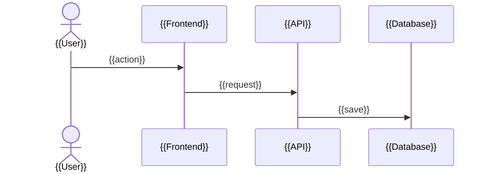

# {{Project Name}} — Project Overview

> **Generated:** {{YYYY-MM-DD}} · **Last updated:** {{YYYY-MM-DD}}
> **Scope:** {{whole repository / folders covered}} · **Excluded:** {{...}}

<!--
TEMPLATE INSTRUCTIONS
- This is action 3. It runs after `claude-context/Project Overview/FILE_DESCRIPTIONS.md` and `claude-context/Project Overview/DATABASE_OVERVIEW.md` have been written or updated in the same run.
- Summarize the two earlier documents. Do not repeat their detail; link to it.
- Flow step numbers follow "Core flow step numbers" in 00_GENERATION_RULES.md.
- Follow 00_GENERATION_RULES.md and 01_LANGUAGE_GUIDE.md.
- Everything inside HTML comments is guidance. Remove it from the final document.
-->

## At a Glance

<!--
Answer:
- What does this app do, in one sentence?
- Who uses it, and what problem does it solve for them?
- What is its current status (prototype, in production, maintenance)?
Keep this to three to five sentences. A stakeholder who reads only this section should understand what the app is.
-->

{{...}}

## Glossary

<!--
Answer:
- Which business terms and internal names would confuse a newcomer?
- Which code names differ from business names (for example `Client` in code means "customer")?
One line per term. Sort alphabetically. All three documents use these names.
-->

| Term | Meaning |
|---|---|
| {{Term}} | {{One-line definition}} |

## Tech Stack

<!--
Answer:
- Which languages, frameworks, database, and hosting does the app use?
- Which key libraries matter for understanding the app? (skip small utilities)
- Which third-party services does it depend on (payments, email, auth, AI APIs), and what is each used for?
-->

| Part | Technology | Used for |
|---|---|---|
| {{Backend}} | {{...}} | {{...}} |
| {{Database}} | {{...}} | {{...}} |
| {{External service}} | {{...}} | {{...}} |

## High-Level Architecture

<!--
Answer:
- What are the main parts of the app (for example: web page, API, background worker, database, external services)?
- What does each part do, in one sentence?
- How do the parts talk to each other (web requests, queues, webhooks, scheduled jobs)?
- What runs where (browser, server, cloud service)?
Start with one plain-language paragraph, then the diagram, then one line per part.
-->

{{Plain-language paragraph.}}

```mermaid
flowchart LR
    {{User}} --> {{Frontend}} --> {{API}} --> {{Database}}
```

- **{{Part}}:** {{What it does. Link to the main folder in FILE_DESCRIPTIONS.md.}}

## Core Data Flow

<!--
Answer:
- What starts the main flow (a user action, a schedule, an incoming webhook)?
- What happens at each step, from start to final result?
- For each step: which part of the app does it, which file or function, and which tables are read or written?
- What does the user or business get at the end?
Describe only the main successful path. Step numbers follow "Core flow step numbers" in 00_GENERATION_RULES.md.
-->

{{One or two sentences on what the flow achieves.}}



<a id="flow-step-1"></a>
**1. {{Step name}}**
{{What happens, in one or two sentences.}}
*Code:* [`{{function()}}`](FILE_DESCRIPTIONS.md#file-{{anchor}}) · *Data:* [`{{table}}`](DATABASE_OVERVIEW.md#table-{{table}}) ({{created / read / updated}})

<a id="flow-step-2"></a>
**2. {{Step name}}**
{{...}}

**Result:** {{What the user or business has at the end.}}

## Phases

<!--
Answer:
- Take the phases, their goals and the current phase from `docs/project-phase-plan.md`. Link to it.
- What does each phase deliver, in one business sentence and one technical sentence?
- For the current phase: what is done, and what is not built yet? Judge this from the code, not
  from the phase plan, which does not track progress.
Only describe phases the repository documents. Do not invent a roadmap.
-->

{{One or two sentences on how the work is split into phases, and which phase is current.}}

| Phase | Delivers (business) | Delivers (technical) | Status |
|---|---|---|---|
| {{1 — Name}} | {{...}} | {{...}} | {{Done / In progress / Not started}} |

**Current phase:** {{What is done, what is still to build. Link finished parts to FILE_DESCRIPTIONS.md.}}

## Repository Structure

<!--
Answer:
- What does each top-level folder contain?
- Where should a new developer start reading?
Only top-level folders, plus one level deeper where it helps. Link to FILE_DESCRIPTIONS.md for detail.
-->

```
{{project-root}}/
├── {{src/}}        {{What lives here}}
├── {{migrations/}} {{What lives here}}
└── {{tests/}}      {{What lives here}}
```

**Start reading here:** {{file or folder, and why}}

## Development Workflow

<!--
Answer:
- How do you set up and run the project locally? Give exact numbered steps and commands.
- How do you run tests, linting, and formatting?
- What is the branching, pull request, and review process?
- How does CI/CD work, and how does code reach production?
- How do you add a database migration? Link to DATABASE_OVERVIEW.md rather than repeating it.
Only include what the repository shows (README, scripts, CI config). Mark anything else with ⚠️ Needs confirmation.
-->

### Run Locally

1. {{...}}

### Tests and Code Checks

{{...}}

### Branches and Reviews

{{...}}

### Deployment

{{...}}

### Database Changes

<!-- If the project has no database, replace the line below with: "Not relevant at this point." -->

See [Migrations and Schema Changes](DATABASE_OVERVIEW.md#migrations-and-schema-changes).

## Logging, Monitoring and Errors

<!--
Answer:
- Where do logs go, and how do you read them?
- How are errors reported (error tracker, alerts, email)?
- What happens when an external service fails (retry, error shown, job queued)?
-->

{{...}}

## Known Limitations and Technical Debt

<!--
Answer:
- What is fragile, incomplete, or planned for rework?
- Use TODO/FIXME comments, open issues, and obvious gaps as sources.
Write each item as a plain fact, one line each. No blame, no judgement.
-->

- {{...}}

## Where to Go Next

- [File Descriptions](FILE_DESCRIPTIONS.md): what each file and function does.
- [Database Overview](DATABASE_OVERVIEW.md): tables, fields, and how they connect.

**Suggested reading order for a new developer:**

1. {{This document: At a Glance, Glossary, Core Data Flow}}
2. {{Database Overview: the main tables}}
3. {{File Descriptions: the files named in the Core Data Flow}}
