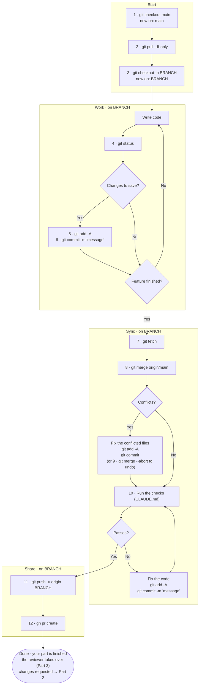
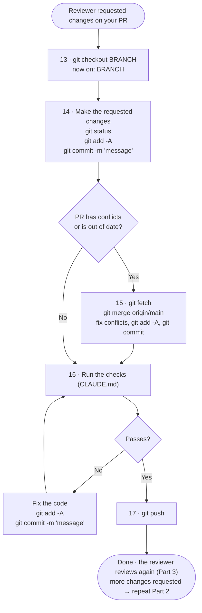
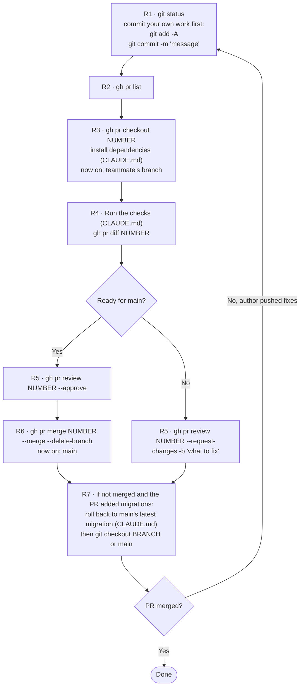

# Project Workflow

How our team builds features and gets them into `main`. Follow the steps in order, every time.

The basic idea: everyone works on their own branch, nobody changes `main` directly, and every change goes through a pull request that a teammate reviews and approves before it's merged.

This file has three processes:

- **[Part 1 · Working on a new feature](#part-1--working-on-a-new-feature)** (steps 1–12), when you're building something. Your part ends when you open the pull request.
- **[Part 2 · Making changes the reviewer requested](#part-2--making-changes-the-reviewer-requested)** (steps 13–17), only if the reviewer asks for changes on your pull request. Otherwise you skip it.
- **[Part 3 · Reviewing a teammate's pull request](#part-3--reviewing-a-teammates-pull-request)** (steps R1–R7), when someone asks you to review their work

For a plain-language summary of building a feature with the agent, see [Simplified process description](#simplified-process-description) at the end.

---

## Key terms

| Term | Meaning |
|---|---|
| **main** | The official version of the project that the whole team builds on. Your computer has its own local copy of it. |
| **origin/main** | Git's record of what main looks like on GitHub. It updates when you run `git fetch` or `git pull`. |
| **branch** | A separate working version where you build one feature without changing main. Your project folder shows one branch at a time, and switching branches changes the files in the folder to match that branch. |
| **commit** | A saved snapshot of your changes, with a short description. |
| **GitHub** | Where the shared project is stored online. |
| **pull request (PR)** | A request on GitHub asking the team to review your branch before it's merged into main. |
| **BRANCH** | Placeholder in this file. Replace it with your branch name, `NN-short-slug` as `CLAUDE.md` names it, for example `12-password-reset`, or `short-slug` when there's no issue. |
| **the checks** | The commands listed in `CLAUDE.md` under *Checks* (plus applying migrations first, if the project has a database), tests included. Run them exactly as listed there. In Part 1 with the agent, `/feature test` runs the tests and `/feature finalize` the rest (see step 10). |
| **NUMBER** | Placeholder for a pull request's number, shown by `gh pr list`. |
| **OWNER/REPO** | Placeholder for the project's GitHub path, for example `my-org/my-app`. |

---

## Team rules

1. **Never commit or push directly to main.** All work happens on a branch. One exception: the commit that adds the template and the `/setup` files, made before the project is on GitHub. Documentation updates made with `/professorslughorn` (the design docs, `CLAUDE.md` and `claude-context/Project Overview/`) go through a PR like any other change.
2. **One branch per feature.** Your work on a feature is finished when you open its pull request (step 12). After that, you only go back to the branch if the reviewer requests changes (Part 2). Never reuse a branch for another feature. Every new feature starts at step 1 with a new branch.
3. **Never force-push** (`git push --force` or `-f`).
4. **Every PR needs approval from a teammate** before it's merged.
5. **Always run the checks before pushing.** If it doesn't work on your machine, it doesn't go up.
6. **The reviewer merges the PR** right after approving it (Part 3, step R6). By team agreement, the author doesn't start a new feature until their PR shows **Merged** on GitHub. Until then, they only work on the reviewer's requested changes (Part 2). Each developer checks this themselves. The agent doesn't check it for you.
7. **When in doubt, run `git status`** and read what it says before doing anything else.

---

## One-time setup

**Each team member, on their computer:**

- [ ] Install Git and the GitHub CLI (`gh`)
- [ ] Log in to GitHub from the terminal: `gh auth login`
- [ ] Download the project: `gh repo clone OWNER/REPO`, then `cd REPO`
- [ ] Check the connection to GitHub: `git remote -v` should show `origin`
- [ ] Install the dependencies: the install command under *Commands* in `CLAUDE.md`
- [ ] Start any local services and set up the database, if there is one: the commands under *Commands* and *Database migrations* in `CLAUDE.md`

**Once per repository, by whoever manages it on GitHub:**

- [ ] **Settings → General → Pull Requests:**
  - turn on **Automatically delete head branches**, so merged branches are removed on GitHub even when merged from the website
- [ ] Make sure `.gitignore` covers secrets (`.env`, keys), build output, dependencies and editor files

GitHub doesn't enforce rules 1, 4 and 6 for this repository. The team follows them by agreement.

---

## Part 1 · Working on a new feature

### Overview



### Step by step

| # | Stage | Command | Branch you're on (before → after) | What it does | Why |
|---|---|---|---|---|---|
| 1 | Start | `git checkout main` | any branch → **main** | Switches to main. Git changes the files in your project folder to match main's version. Your other branches stay saved and come back when you switch to them. | `git pull` and `git checkout -b` both work on whichever branch you're currently on, so you need to be on main first. If you're already on main, nothing happens. |
| 2 | Start | `git pull --ff-only` | main → main | Downloads the latest version of main from GitHub and updates your local main. | So your new branch includes your team's latest work. If your local main has changes that aren't on GitHub, it stops and warns you instead of combining them (see [Troubleshooting](#troubleshooting)). |
| 3 | Start | `git checkout -b BRANCH` | main → **BRANCH** | Creates a new branch from main and switches to it. | Your work stays separate from main until it's reviewed. |
| 4 | Work | `git status` | BRANCH → BRANCH | Lists the files you've changed and shows whether anything is unsaved. It also tells you which branch you're on. | A quick check of where you stand. Safe to run anytime. |
| 5 | Work | `git add -A` | BRANCH → BRANCH | Selects all changed, new, and deleted files to be included in the next commit. | Git only saves the files you select. Check the list from `git status` first so no passwords, keys, or junk files get included. |
| 6 | Work | `git commit -m "message"` | BRANCH → BRANCH | Saves the selected changes as a commit, which is a snapshot with your description. | Records your progress on your branch. Commit often, and always before switching branches, so your changes stay with the right branch. |
| 7 | Sync | `git fetch` | BRANCH → BRANCH | Downloads information about what's new on GitHub and updates origin/main. Your files and your local main don't change. | Step 8 merges from origin/main, so it has to be up to date first. |
| 8 | Sync | `git merge origin/main` | BRANCH → BRANCH | Adds the changes from GitHub's main into your branch. Your local main is not touched. | Your branch then contains your work plus your team's latest work. If you and a teammate changed the same lines, Git shows a conflict so you fix it on your branch, not on main. After fixing, run `git add -A` and `git commit`. If the project has a database, run the single-head check from `CLAUDE.md`. If it shows two latest migrations, fix it as `/feature finalize` step 2 describes. |
| 9 | Sync *(only if needed)* | `git merge --abort` | BRANCH → BRANCH | Cancels the merge and returns your branch to how it was before step 8. | Use it if a conflict gets confusing. Nothing is lost, and you can try step 8 again. |
| 10 | Sync | *Run the checks* (see `CLAUDE.md`) | BRANCH → BRANCH | Checks that the project works with both your changes and your team's. With the agent, this is split: `/feature test` runs the tests, `/feature finalize` runs the other checks. If step 8 brought in new work, `/feature finalize` stops so you run `/feature test` again first. | Changes that work separately can still break when combined. Don't continue until this passes. |
| 11 | Share | `git push -u origin BRANCH` | BRANCH → BRANCH | Uploads your branch to GitHub. `-u` links your local branch to the GitHub copy, so later you can just type `git push`. | Your team can only review what's on GitHub. This does not change main. |
| 12 | Share | `gh pr create` | BRANCH → BRANCH | Opens a pull request on GitHub with a title and a description of your changes. | Asks your team to review your branch before it goes into main. Comments and approval happen there. Share the link with your team. |

**With the agent**, the `/feature` actions run these steps for you:

| Action | Steps | Tests? |
|---|---|---|
| `/feature describe` | 1–2, then writes the spec | No |
| `/feature implement` | 2–6 | No |
| `/feature test` | writes and runs the tests, then 4–6 | Yes, the only one |
| `/feature finalize` | 4–12, with step 10's tests left to `/feature test` | No |

Steps 4–6 are "save your work", so every action that changes files repeats them. Each action also has its own kind of check:

| Action | What changes in the files | Its "checks" | Saves with steps 4–6? |
|---|---|---|---|
| `/feature implement` | The feature's code | None, you try it by hand | Yes |
| `/feature test` | New test files, plus bug fixes if a test finds one | **Unit tests** (the whole test suite) | Yes |
| `/feature finalize` | Small fixes, e.g. formatting or style, plus the spec's status line | **Format, lint, type checks**, everything except the tests | Yes |

Steps 7–12 (sync with `main`, check, push, open the PR) happen only once, in `/feature finalize`.

**Example: building "password reset"**

1. **Implement** writes the reset code and commits it (steps 2–6). You try it by hand and the email arrives.
2. **Test** writes 5 unit tests and runs all 42 tests. One fails because expired links are accepted. It fixes the code, reruns the tests (all pass) and commits (steps 4–6).
3. **Finalize** pulls in the team's latest work (steps 7–8). Then one of two things happens:
   - **Nothing new on `main`:** it runs format, lint and type checks, which make up step 10 without the tests. The formatter fixes one line, finalize commits, pushes and opens the PR (steps 11–12).
   - **A teammate's work came in:** it stops, because the 42 tests passed on code that didn't include your teammate's changes. You run `/feature test` again, then `/feature finalize` again.

So step 10, "run the checks", is split in two: the tests ran in `/feature test`, and finalize runs everything else. If a finalize fix changes what the code does, not just how it looks, finalize also sends you back to `/feature test`.

**Part 1 ends here.** Your work on the feature is done once the PR is open. From here:

- **The reviewer requests changes:** follow [Part 2](#part-2--making-changes-the-reviewer-requested).
- **The reviewer approves and merges:** nothing to do on this branch. When the PR shows **Merged**, start your next feature at step 1. Steps 1–2 bring your local main up to date, including your merged PR. Optional: delete the old branch with `git branch -d BRANCH` while on main.

### Checkpoints

Don't move to the next stage until the checkpoint is true.

| After stage | Check |
|---|---|
| Start | `git status` says you're on BRANCH. |
| Work | `git status` says *nothing to commit, working tree clean*. |
| Sync | The merge is finished with no conflicts left, the working tree is clean, and the checks pass. |
| Share | The PR exists on GitHub and your team has the link. |

### Writing a good pull request

- **Title and description:** follow the PR format in `CLAUDE.md` under *Workflow*.
- **Keep it small.** One feature per PR. Small PRs get reviewed faster and have fewer conflicts.

---

## Part 2 · Making changes the reviewer requested

**Only if needed.** Use this part only when the reviewer requests changes on your PR, or GitHub says your PR has conflicts. If the reviewer approves and merges, skip it.

### Overview



### Step by step

| # | Stage | Command | Branch you're on (before → after) | What it does | Why |
|---|---|---|---|---|---|
| 13 | Return | `git checkout BRANCH` | any branch → **BRANCH** | Switches back to your feature branch. | The fixes belong on the same branch as the PR. Commit any other work first, so it stays on its own branch. If you're already on BRANCH, nothing happens. |
| 14 | Fix | Make the changes, then `git status` + `git add -A` + `git commit -m "message"` | BRANCH → BRANCH | Saves the changes the reviewer asked for, the same way as steps 4–6. | Keeps the fixes on the PR's branch. Only change what the reviewer asked for. |
| 15 | Sync *(only if GitHub says the PR has conflicts or is out of date)* | `git fetch` + `git merge origin/main` | BRANCH → BRANCH | Adds the team's latest main into your branch, the same way as steps 7–9. | main changed since you opened the PR. Fix conflicts here, on your branch, then `git add -A` and `git commit`. If the project has a database, run the single-head check from `CLAUDE.md`, as in step 8. |
| 16 | Check | *Run the checks* (see `CLAUDE.md`) | BRANCH → BRANCH | Checks that the project still works with your fixes. | Rule 5: nothing goes up unless it works on your machine. |
| 17 | Share | `git push` | BRANCH → BRANCH | Uploads your fixes to your branch on GitHub. | The PR updates automatically. Let the reviewer know it's ready for another look. |

**Part 2 ends here.** Your part is done again. The reviewer checks the PR again (Part 3). If they request more changes, repeat Part 2.

---

## Part 3 · Reviewing a teammate's pull request

### Overview



### Step by step

| # | Stage | Command | Branch you're on (before → after) | What it does | Why |
|---|---|---|---|---|---|
| R1 | Prepare | `git status`, then if needed `git add -A` + `git commit -m "message"` | your branch → your branch | Saves any unfinished work on your own branch. | The next steps switch branches. Committing first keeps your own work safe and separate from your teammate's. |
| R2 | Find | `gh pr list` | your branch → your branch | Shows open pull requests waiting for review, with their numbers. | So you can see what needs your attention and find the PR number. |
| R3 | Get the code | `gh pr checkout NUMBER`, then the install command from `CLAUDE.md` | your branch → **teammate's branch** | Downloads that pull request's branch to your computer and switches to it, then installs any packages the PR added. | So you can run and test your teammate's changes yourself. If you're reviewing again after they pushed fixes, run this again to get the latest version. |
| R4 | Test | *Run the checks* (see `CLAUDE.md`), and `gh pr diff NUMBER` | teammate's branch → same | Checks that the project works with their changes, and shows exactly which lines changed. | Make sure it builds, works, and doesn't include secrets or junk files. You can also read and comment on the changes on the PR page on GitHub. |
| R5 | Decide | `gh pr review NUMBER --approve` **or** `gh pr review NUMBER --request-changes -b "what to fix"` | teammate's branch → same | Approves the PR, or asks for changes with your explanation. | Approval allows the PR to be merged into main. A request for changes blocks it until the author fixes it and it's approved. |
| R6 | Merge *(only if approved)* | `gh pr merge NUMBER --merge --delete-branch` | teammate's branch → **main** | Adds the approved changes to main on GitHub with a merge commit, deletes the branch on GitHub and on your computer, and switches you to main. | The reviewer finishes the PR. The author can't start their next feature until it's merged. Only run this after you approved and the checks pass (on GitHub too, if the project has CI). |
| R7 | Return | If you didn't merge and the PR added migrations: roll back to the latest migration on main, with the *Roll back to a specific migration* command under *Database migrations* in `CLAUDE.md`. Then `git checkout BRANCH`, or stay on `main` | teammate's branch or main → **your branch** or **main** | Undoes the PR's migrations on your local database, then switches back to your own branch, or leaves you on main. | Your database ran the PR's migration in R4. Code that doesn't have that migration may fail against a database that does. Don't make changes on your teammate's branch; leave comments on the PR instead. |

The author is waiting for this merge before starting their next feature, so merge promptly once you approve. They don't need to do anything after you merge: their next feature starts with Part 1, steps 1–2, which pull the merged work into their local main.

### What to check in a review

- Do the checks in `CLAUDE.md` pass?
- Does the feature work when you try it?
- Is anything confusing or hard to follow? Ask on the PR.
- Are there any passwords, keys, `.env` files, or build output in the changes?
- Does the PR do one thing, as described in its title?

---

## Troubleshooting

| Problem | What it means | What to do |
|---|---|---|
| `git pull --ff-only` fails on main (step 2) | You accidentally committed on main, so your local main doesn't match GitHub. | Make sure everything is committed. Then run `git branch BRANCH` (saves your commits on a new branch), `git reset --hard origin/main` (puts main back to GitHub's version), and `git checkout BRANCH`. Continue from step 4. |
| Merge conflict and you're lost (step 8) | The combined changes clash and it got messy. | `git merge --abort`, then try step 8 again. Ask the teammate who changed the same file if you're unsure which version to keep. |
| `git push` rejected on your branch | GitHub has commits on your branch that you don't have. | `git pull --no-rebase`, fix any conflicts, then `git push`. Never use `--force`. |
| GitHub says the PR has conflicts or is out of date | main has changed since your last sync. | Follow Part 2 (steps 13–17). |
| `gh pr checkout` or `git checkout` refuses to switch | You have unsaved changes that would be overwritten. | Commit your work first (steps 4–6), then try again. |
| `git branch -d` says "not fully merged" | Your local main doesn't have the merged PR yet, or the branch has commits that were never pushed. | Run steps 1–2 first, then try again. If it still fails, check that the PR shows **Merged** on GitHub and that `git log origin/main..BRANCH` shows nothing you need, then use `git branch -D BRANCH`. |
| `gh: not logged in` | The GitHub CLI isn't connected to your account. | `gh auth login` |
| Not sure which branch you're on | | `git branch --show-current` or `git status` |
| You committed a password or key | It's now in the project's history. | Don't push. Tell the team. Remove it, change the password or key wherever it's used, and ask for help cleaning the history. If it was already pushed, change the password or key immediately. |

---

## Cheat sheet

### Working on a new feature

```bash
# Start (steps 1–3)
git checkout main
git pull --ff-only
git checkout -b BRANCH

# Work (steps 4–6), repeat as you go
git status
git add -A
git commit -m "message"

# Sync with the team's latest work (steps 7–10)
git fetch
git merge origin/main
# fix conflicts if any, then: git add -A && git commit
# database only: run the single-head check from CLAUDE.md
# run the checks listed in CLAUDE.md

# Share (steps 11–12)
git push -u origin BRANCH
gh pr create

# Done: your part is finished. Wait until the reviewer merges.
# Only then start the next feature at step 1.
# Optional, once you're on an updated main:
git branch -d BRANCH
```

### Making changes the reviewer requested (only if needed)

```bash
git checkout BRANCH         # 13: back to your feature branch
# 14: make the changes, then:
git status
git add -A
git commit -m "message"
# 15: only if GitHub says the PR has conflicts or is out of date:
git fetch
git merge origin/main
# fix conflicts if any, then: git add -A && git commit
# database only: run the single-head check from CLAUDE.md
# 16: run the checks listed in CLAUDE.md
git push                    # 17: the PR updates automatically
```

### Reviewing a teammate's pull request

```bash
git status                  # R1: commit your own work first if needed
gh pr list                  # R2: find the PR number
gh pr checkout NUMBER       # R3: get their branch
# R3: run the install command from CLAUDE.md (picks up any packages the PR added)
gh pr diff NUMBER           # R4: see what changed, then run the checks in CLAUDE.md
gh pr review NUMBER --approve                                 # R5: approve
gh pr review NUMBER --request-changes -b "what to fix"        # R5: or ask for changes
gh pr merge NUMBER --merge --delete-branch                    # R6: merge, only if approved
# R7: only if not merged and the PR added migrations: roll back to main's latest migration (CLAUDE.md)
git checkout BRANCH         # R7: back to your own branch (or stay on main)
```

---

## Simplified process description

How a feature gets built with the agent (`/feature describe`, `/feature implement`, `/feature test`, `/feature finalize`), in plain language.

**Two modes.** You choose one when you describe the feature, and it applies to every step of that feature:

- **VERBOSE** (default): the agent asks before every command, commit and fix. Good for learning and for careful work. `/feature describe "<idea>"`
- **SURF**: the agent runs routine commands, commits and fixes on its own, and tells you what it did. It still asks before uploading, before opening the pull request, before writing tests, and whenever it needs your decision. `/feature describe SURF "<idea>"`

**1. Describe the feature**

- You tell the agent what you want, often by naming a GitHub issue.
- The agent first gets the latest main version of the project from GitHub, so the plan fits the team's newest work.
- It reads the project's design documents and the issue, and asks you about anything unclear.
- It writes a plan for the feature and saves it in the `claude-context` folder.
- It stops there. You read the plan and change it if needed.

**2. Build the feature**

- You tell the agent which plan to build.
- The agent checks that you're starting from the main version of the project, with nothing unsaved.
- It gets the latest version from GitHub and creates a separate working copy for this feature, called a branch.
- It builds the feature, explains in plain language what it changed, and tells you how to see it working. It doesn't write tests yet.
- It saves the work, after you approve (VERBOSE) or on its own (SURF).
- You try the feature yourself. If something doesn't work, you tell the agent and it fixes it.

**3. Test the feature**

- The agent picks the parts of the feature worth testing automatically, like rules, calculations and edge cases.
- It shows you a table: what each test checks, why it matters, and an example. Nothing is written until you approve.
- It writes the tests and runs all of the project's tests. If one fails, it explains why, proposes a fix (to the test or to the feature), and repeats until everything passes.
- It notes the results in the plan and saves the work, after you approve (VERBOSE) or on its own (SURF).

**4. Finish the feature**

- The agent saves anything left over.
- It brings in any new work your teammates added to GitHub, and checks that nothing clashes. If new work came in, it sends you back to step 3 to run the tests again.
- It runs the project's other automatic checks, like code style. It doesn't run the tests. If a check fails, it explains why, proposes a fix, and repeats until everything passes.
- It marks the plan as done ("PR created"), so it isn't mistaken for a new feature later.
- It uploads the branch to GitHub and opens a pull request asking a teammate to review it.
- It switches you back to the main version. Your part of the feature is now done.
- If the feature changed something major in the project's design, it gives you a short summary.

**5. Review and merge, done by a teammate**

- The reviewer checks the work and runs the same checks.
- If it's good, the reviewer approves it and adds it to the main version.
- If changes are needed, the reviewer asks for them on GitHub.

**6. Make the requested changes (only if the reviewer asks for them)**

- You switch back to the feature's branch and make the changes.
- You run the checks again and upload the changes. The pull request updates automatically.
- The reviewer looks again. Repeat until they approve and merge.

**7. Update the documentation (after features are merged)**

- From the main version, with no pull requests open, you run `/professorslughorn`.
- The agent finds the merged features the documentation doesn't cover yet, shows you the changes it wants to make to the design and to `CLAUDE.md`, and waits for your OK.
- It updates the documentation, marks those features' plans as "Documented", and opens one pull request for a teammate to review.

**Rules throughout**

- The agent shows every command before running it. In VERBOSE mode (the default) it waits for your OK on each one. In SURF mode it only waits before uploading to GitHub, opening the pull request, and writing the tests (the test plan), plus anything that needs your decision, like conflicts.
- Nothing is ever saved directly to the main version, except the commit that adds the template and the `/setup` files before the project is on GitHub (see Team rule 1).
- Claude is never credited in saved work or in pull requests.

**Team agreement (you check this yourself, not the agent)**

- Nobody starts a new feature until their previous PR is approved and merged on GitHub by the reviewer.
